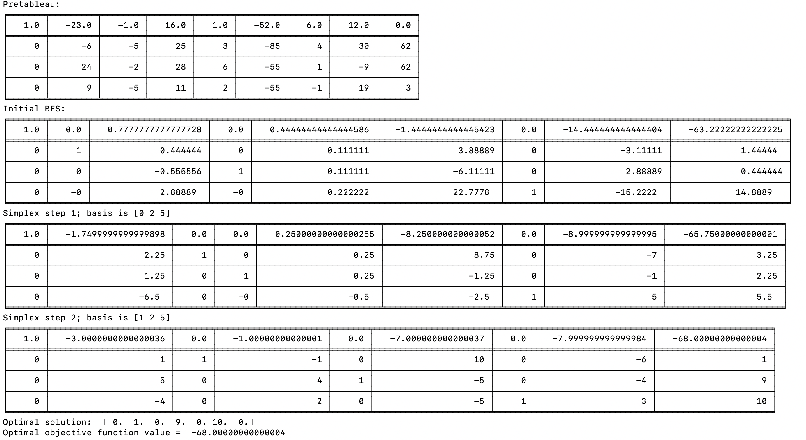

# Simplex method

This is a simple Python implementation for simulating the 
simplex algorithm for solving linear programming problems
of the form:

min c^T x s.t. Ax = b, x >= 0

The code was written as part of a homework assignment
for course 553.762 (Constrained Optimization) during 
Spring 2020 term at Johns Hopkins University.

Author: Desh Raj (draj@cs.jhu.edu)

## How to run?

```
./simplex.py [options..] <matrix-A-file> <vector-b-file> <vector-c-file> <out-file>
```

The optional arguments are:
`--random-seed`: provide a random seed for the big-M method
`--initial-basis`: provide an initial basis for the matrix A to compute initial BFS
`--basis-index`: specify wheter the basis is 0 or 1 indexing (1 by default)

## Example usage

```
./simplex.py --initial-basis sample/basis sample/A sample/b sample/c sample/out
```


